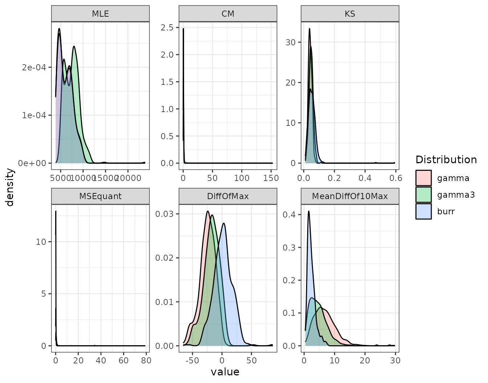
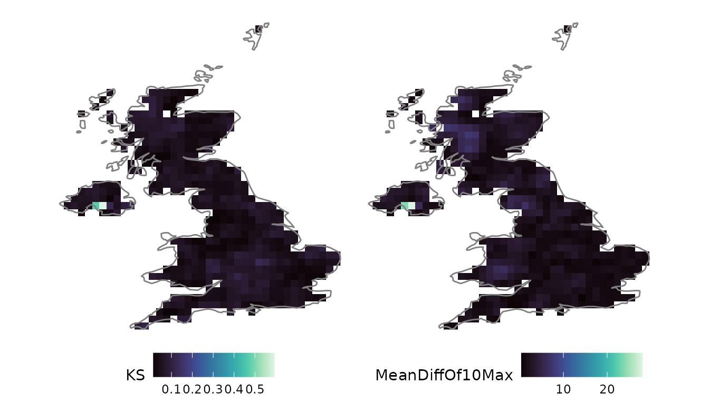
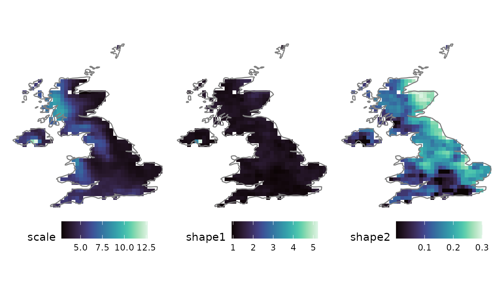
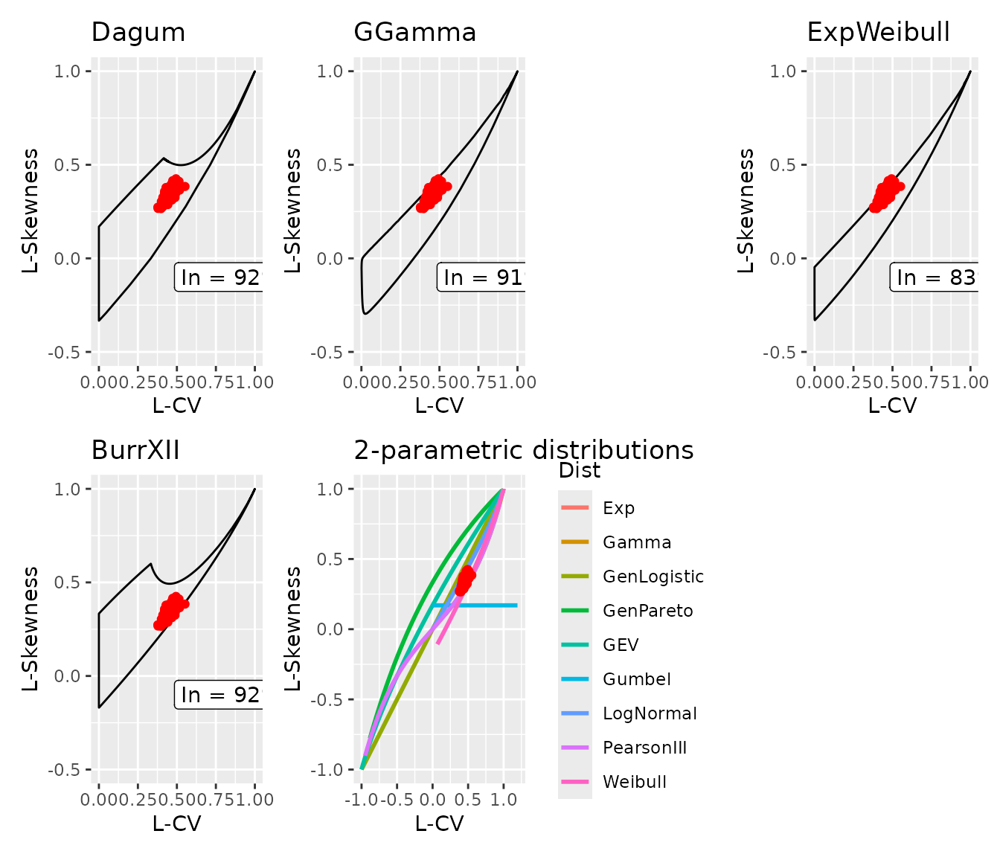
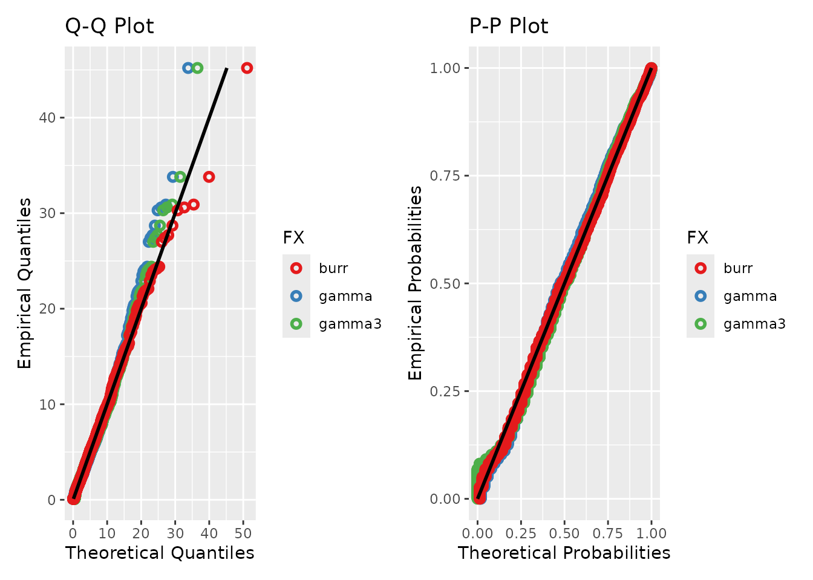

# Distribution fitting with L-moments

``` r

library(anyFit)
library(xts)
library(ggplot2)
library(patchwork)
```

## 1. Why L-moments?

Fitting a marginal distribution is central to hydrological risk
assessment and to parameterising stochastic simulators. anyFit performs
this fitting through the method of **L-moments** rather than Maximum
Likelihood Estimation (MLE), for two reasons of particular relevance to
hydroclimatic data:

- **Robustness.** L-moments are linear combinations of ordered values,
  so they are far less sensitive to outliers than product moments, an
  advantage for the skewed, heavy-tailed distributions typical of
  precipitation.
- **No i.i.d. assumption.** MLE assumes independent, identically
  distributed observations. Hydroclimatic series are autocorrelated,
  which biases MLE; L-moment estimators do not rely on independence.

Estimation is performed in two ways. For distributions whose L-moments
have a closed form (Gamma, Weibull, Gumbel, Log-Normal, GEV, …) the
analytical equations are used. For flexible multi-parameter families
without closed-form L-moments (Generalised Gamma, Burr type-XII, Dagum,
Exponentiated Weibull), anyFit performs a fast bounded optimisation
(L-BFGS-B), initialised from pre-computed tables that span the feasible
L-ratio space, so that no user-supplied initial values are needed.

### Supported distributions

| Distribution | Parameters | R designation |
|----|----|----|
| Exponential | location, scale | `exp` |
| Rayleigh | location, scale | `rayleigh` |
| Gamma | scale, shape | `gamma` |
| Normal | mean, sd | `norm` |
| Log-Normal | scale, shape | `lognorm` |
| Generalised Logistic | location, scale, shape | `genlogi` |
| 3-parameter Weibull | location, scale, shape | `weibull` |
| Gumbel | location, scale | `gumbel` |
| 3-parameter Gamma (Pearson III) | location, scale, shape | `gamma3` |
| Generalised Extreme Value | location, scale, shape | `gev` |
| Generalised Pareto | location, scale, shape | `gpd` |
| Generalised Gamma | scale, shape1, shape2 | `gengamma` |
| Generalised Gamma with location | location, scale, shape1, shape2 | `gengamma_loc` |
| Burr type-XII | scale, shape1, shape2 | `burr` |
| Dagum | scale, shape1, shape2 | `dagum` |
| Exponentiated Weibull | scale, shape1, shape2 | `expweibull` |

Each family follows the standard R `d`/`p`/`q`/`r` notation (`dburr`,
`pgev`, `qgamma3`, `rdagum`, …), and each has a matching `fitlm_` fitter
([`fitlm_burr()`](https://gapouliasis.github.io/anyFit/reference/fitlm_burr.md),
[`fitlm_gev()`](https://gapouliasis.github.io/anyFit/reference/fitlm_gev.md),
…).

## 2. Fitting across a grid

We load the bundled E-OBS daily rainfall, clipped to the UK, and fit
several candidates at every grid cell with
[`fitlm_nc()`](https://gapouliasis.github.io/anyFit/reference/fitlm_nc.md).
Setting `ignore_zeros = TRUE` excludes dry days so that the fit
describes wet-day rainfall.

``` r

f <- system.file("extdata", "rr_ens_mean_0.25deg_reg_2011-2022_v27.0e.nc",
                 package = "anyFit")
uk_name <- "U.K. of Great Britain and Northern Ireland"
rain_uk <- nc2xts(f, varname = "rr", country = uk_name)

candidates <- c("gamma", "gamma3", "burr")
fits <- fitlm_nc(rain_uk, ignore_zeros = TRUE, candidates = candidates)
```

## 3. Comparing the candidates

[`fitlm_nc()`](https://gapouliasis.github.io/anyFit/reference/fitlm_nc.md)
returns a summary of the goodness-of-fit measures as densities over all
grid cells. These measures include the negative log-likelihood (MLE),
the Cramér–von Mises (CM) and Kolmogorov–Smirnov (KS) statistics, the
mean squared error of quantiles (MSEquant), the percentage difference of
the maximum (DiffOfMax) and the mean difference of the ten largest
values (MeanDiffOf10Max). The densities are a visual aid for judging
which distribution performs best across most of the domain, rather than
a formal test.

``` r

fits$gof_plots
```



The upper-tail metrics (`DiffOfMax`, `MeanDiffOf10Max`) are the relevant
diagnostics when extremes are of interest. The flexible Burr XII
typically captures the tail better than the two-parameter Gamma, which
can be confirmed spatially, since
[`fitlm_nc()`](https://gapouliasis.github.io/anyFit/reference/fitlm_nc.md)
also returns per-cell goodness-of-fit rasters:

``` r

nc_ggplot(fits$fit_results$burr$raster_GoF[[c("KS", "MeanDiffOf10Max")]],
          viridis.option = "mako") &
  borders("world", regions = "UK")
```



## 4. Mapping the fitted parameters

For each candidate, the fitted parameters are returned as a raster, one
layer per parameter. The Burr XII scale and two shape parameters map as:

``` r

nc_ggplot(fits$fit_results$burr$raster_params, viridis.option = "mako") &
  borders("world", regions = "UK")
```



## 5. L-ratio diagnostic diagrams

Every distribution occupies a characteristic region of L-skewness /
L-kurtosis space. Plotting the **sampled** L-ratios against a
distribution’s **theoretical** support provides a direct means of
assessing whether that distribution can describe the data: if the sample
ratios fall outside the support, the distribution cannot fit, regardless
of its parameters.

[`lmom_stats()`](https://gapouliasis.github.io/anyFit/reference/lmom_stats.md)
computes the sample L-moments per cell, and
[`LRatio_check()`](https://gapouliasis.github.io/anyFit/reference/LRatio_check.md)
places them on the diagram for each supported flexible family.

``` r

ts_lmoms <- lmom_stats(rain_uk, ignore_zeros = TRUE)
lcheck   <- LRatio_check(ts_lmoms)
lcheck$multi_plots
```



Individual diagrams are also available,
e.g. `lcheck$distributions$BurrXII$plot`.

## 6. Single-series fitting and diagnostics

For an individual series,
[`fitlm_multi()`](https://gapouliasis.github.io/anyFit/reference/fitlm_multi.md)
fits a list of candidates and returns the fitted parameters, a
goodness-of-fit table, and Q–Q / P–P diagnostic plots. A perfect fit
falls on the 1:1 line. We extract the London grid cell and compare three
candidates.

``` r

london <- nc2xts_nn(f, varname = "rr", coords = data.frame(x = -0.1278, y = 51.5074))
colnames(london) <- "London"

fit_london <- fitlm_multi(london, candidates = list("gamma", "gamma3", "burr"),
                          ignore_zeros = TRUE)
```

``` r

fit_london$diagnostics
```



The goodness-of-fit summary tabulates the same metrics as the gridded
densities, here as a single column per candidate:

``` r

round(fit_london$GoF_summary, 3)
#>                    gamma   gamma3     burr
#> MLE             4299.341 5689.598 4286.447
#> CM                 0.290    0.406    0.141
#> KS                 0.041    0.055    0.026
#> MSEquant           0.397    0.223    0.038
#> DiffOfMax        -31.457  -26.206   -3.028
#> MeanDiffOf10Max    5.792    4.179    1.257
```

## 7. See also

- `vignette("gridded-workflow")`: extreme value analysis with the GEV,
  using the same
  [`fitlm_nc()`](https://gapouliasis.github.io/anyFit/reference/fitlm_nc.md)
  machinery on annual maxima.
- `vignette("point-seasonal")`: fitting distributions **per calendar
  month** to capture seasonality with
  [`fitlm_monthly()`](https://gapouliasis.github.io/anyFit/reference/fitlm_monthly.md).
