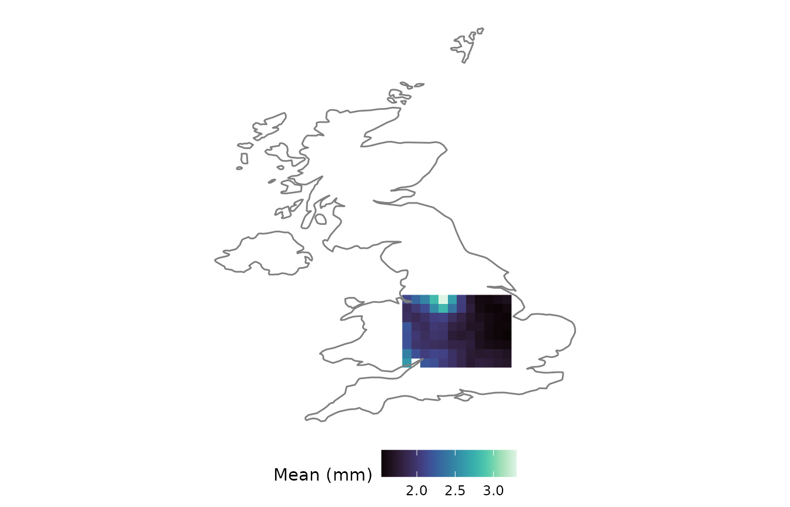
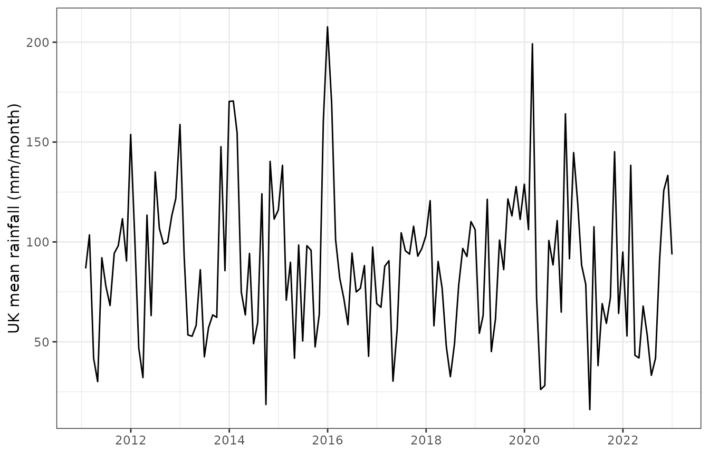

# The sxts (spatial xts) class

``` r

library(anyFit)
library(xts)
library(ggplot2)
library(patchwork)
```

## 1. What is an `sxts`?

Gridded hydroclimatic data are two things at once: a **time series**
(many time steps) and a **spatial field** (many locations). Workflows
that maintain these separately, a `raster` for space and an `xts` for
time, incur both a memory overhead and the constant risk of the two
representations drifting out of alignment.

anyFit’s answer is the **`sxts`** (spatial xts) class. It is a
lightweight S3 extension of `xts`: the data matrix has one **row per
time step** and one **column per grid cell**, and three pieces of
spatial metadata are carried as attributes:

- `coords`: a data frame of `x`/`y` coordinates, one row per column of
  data;
- `projection`: a CRS string describing the coordinate reference system;
- `elements`: the number of spatial locations (i.e. data columns).

Because `sxts` *extends* `xts` rather than replacing it, the entire xts
toolbox (temporal subsetting, period aggregation, date arithmetic)
remains available, while the spatial context is retained through every
operation.

## 2. Constructing an `sxts`

The usual way to obtain one is to read a NetCDF file with
[`nc2xts()`](https://gapouliasis.github.io/anyFit/reference/nc2xts.md),
which returns an `sxts` directly. We use the bundled E-OBS daily
rainfall file, clipped to the UK.

``` r

f <- system.file("extdata", "rr_ens_mean_0.25deg_reg_2011-2022_v27.0e.nc",
                 package = "anyFit")
uk_name <- "U.K. of Great Britain and Northern Ireland"

rain_uk <- nc2xts(f, varname = "rr", country = uk_name)
```

The dedicated [`str()`](https://rdrr.io/r/utils/str.html) and
[`summary()`](https://rdrr.io/r/base/summary.html) methods report the
spatial and temporal extent concisely:

``` r

str(rain_uk)
#> 'sxts' Spatial xts object
#>  Description:  This is a spatial xts (sxts) object 
#>  Projection:  +proj=longlat +datum=WGS84 
#>  Elements:  544  spatial locations
#> Spatial extent is: -7.875 , 1.625 , 50.125 , 60.625  (xmin, xmax, ymin, ymax) 
#>  Time series data:
#> Range of dates is from: 2011-01-01 to: 2022-12-31
```

You can also build an `sxts` from scratch with the
[`sxts()`](https://gapouliasis.github.io/anyFit/reference/sxts.md)
constructor, passing a data matrix, a time index, a coordinate table and
a projection, which is useful when the data do not come from NetCDF. The
constructor validates that the number of coordinate rows matches the
number of data columns.

``` r

set.seed(1)
dates  <- seq(as.POSIXct("2020-01-01", tz = "UTC"), by = "day", length.out = 30)
coords <- data.frame(x = c(-2, -1, 0), y = c(51, 52, 53))
vals   <- matrix(rgamma(30 * 3, shape = 1, scale = 3), nrow = 30, ncol = 3)

toy <- sxts(vals, order.by = dates, coords = coords,
            projection = "+proj=longlat +datum=WGS84")
is.sxts(toy)
#> [1] TRUE
```

## 3. Accessing spatial metadata

Three accessor functions expose the spatial attributes:

``` r

elements(rain_uk)          # number of grid cells
#> [1] 544
projection(rain_uk)        # coordinate reference system
#> [1] "+proj=longlat +datum=WGS84"
head(coords(rain_uk))      # x / y coordinates, one row per cell
#>          x      y
#> 54  -5.625 50.125
#> 55  -5.375 50.125
#> 56  -5.125 50.125
#> 99  -4.875 50.375
#> 100 -4.625 50.375
#> 101 -4.375 50.375
```

## 4. Subsetting is spatially aware

The `[` method treats the two dimensions differently. Subsetting by
**time** (rows), using the full range of xts date-string syntax, retains
every location:

``` r

winter15 <- rain_uk["2015-12"]     # December 2015, all cells
c(rows = nrow(winter15), cells = elements(winter15))
#>  rows cells 
#>    31   544
```

Subsetting by **location** (columns) updates the stored coordinates and
the element count to match, so that the metadata remains consistent with
the data:

``` r

first_ten <- rain_uk[, 1:10]
c(cells = elements(first_ten), coord_rows = nrow(coords(first_ten)))
#>      cells coord_rows 
#>         10         10
```

## 5. Arithmetic, lagging and differencing preserve the class

Element-wise arithmetic, comparison,
[`lag()`](https://rdrr.io/r/stats/lag.html) and
[`diff()`](https://rdrr.io/r/base/diff.html) all return an `sxts` with
the spatial attributes preserved automatically:

``` r

rain_cm <- rain_uk / 10          # mm -> cm
is.sxts(rain_cm)
#> [1] TRUE

lagged <- lag(rain_uk, 1)        # one-day lag, still an sxts
is.sxts(lagged)
#> [1] TRUE
```

## 6. Spatial operations native to `sxts`

### Masking

[`mask.sxts()`](https://gapouliasis.github.io/anyFit/reference/mask.sxts.md)
restricts an `sxts` to a region, given as a bounding box, a shapefile,
or an `sf`/`Spatial*` object. Here we crop to a box over central England
and confirm that the cell count is reduced.

``` r

box <- mask.sxts(rain_uk, xlim = c(-3, 0), ylim = c(51.5, 53.5))
elements(box)
#> [1] 95

nc_ggplot(basic_stats_nc(box)[["Mean"]], legend.title = "Mean (mm)",
          viridis.option = "mako") +
  borders("world", regions = "UK")
```



### Zonal statistics

[`zonal_stats()`](https://gapouliasis.github.io/anyFit/reference/zonal_stats.md)
collapses the spatial dimension by aggregating all cells that fall
within one or more polygons (supplied as a shapefile, a country or a
continent) and returns a plain `xts` with one column per polygon. Below
we compute the daily spatial-mean rainfall over the UK, then aggregate
it to monthly totals for a readable series. Because the E-OBS grid
contains some missing cells, we supply an `na.rm = TRUE` mean, so that a
single missing cell does not propagate to the entire day.

``` r

uk_mean_daily <- zonal_stats(rain_uk, country = uk_name,
                             FUN = function(x) mean(x, na.rm = TRUE))
uk_monthly <- aggregate_xts(uk_mean_daily, periods = "months",
                            FUN = "sum")$list_months$aggregated

autoplot(uk_monthly) +
  labs(y = "UK mean rainfall (mm/month)", x = NULL) +
  theme_bw()
```



### Conversion to and from rasters

When data must be passed to a raster-based tool,
[`rasterFromSxts()`](https://gapouliasis.github.io/anyFit/reference/rasterFromSxts.md)
produces a `RasterBrick` with time as the z-dimension, and
[`sxtsFromRaster()`](https://gapouliasis.github.io/anyFit/reference/sxts.md)
performs the inverse conversion. The round trip is lossless for the data
and reconstructs the spatial metadata.

``` r

brick_uk <- rasterFromSxts(rain_uk)
class(brick_uk)
#> [1] "RasterBrick"
#> attr(,"package")
#> [1] "raster"

back <- sxtsFromRaster(brick_uk)
c(is_sxts = is.sxts(back), cells = elements(back))
#> is_sxts   cells 
#>       1     499
```

## 7. Concatenating along time

Reading a multi-file dataset produces a *list* of `sxts` objects that
share a grid.
[`rbindlist.sxts()`](https://gapouliasis.github.io/anyFit/reference/rbindlist.sxts.md)
concatenates them into one continuous series in a single pass, which is
considerably faster than repeated pairwise `rbind`. To illustrate, we
split the UK series into two by time and recombine it.

``` r

part1 <- rain_uk["2011/2016"]
part2 <- rain_uk["2017/2022"]

recombined <- rbindlist.sxts(list(part1, part2))
c(rows = nrow(recombined), cells = elements(recombined))
#>  rows cells 
#>  4383   544
```

## 8. Benefits of using the sxts class

By carrying space and time in a single validated object, `sxts`
eliminates the risk of misalignment between the spatial and temporal
components, so that the remaining anyFit functionality, namely
statistics
([`basic_stats_nc()`](https://gapouliasis.github.io/anyFit/reference/basic_stats_nc.md)),
aggregation
([`period_apply_nc()`](https://gapouliasis.github.io/anyFit/reference/period_apply_nc.md)),
fitting
([`fitlm_nc()`](https://gapouliasis.github.io/anyFit/reference/fitlm_nc.md))
and plotting
([`nc_ggplot()`](https://gapouliasis.github.io/anyFit/reference/nc_ggplot.md)),
operates on a single, coherent structure. See
`vignette("gridded-workflow")` for that pipeline end to end.
