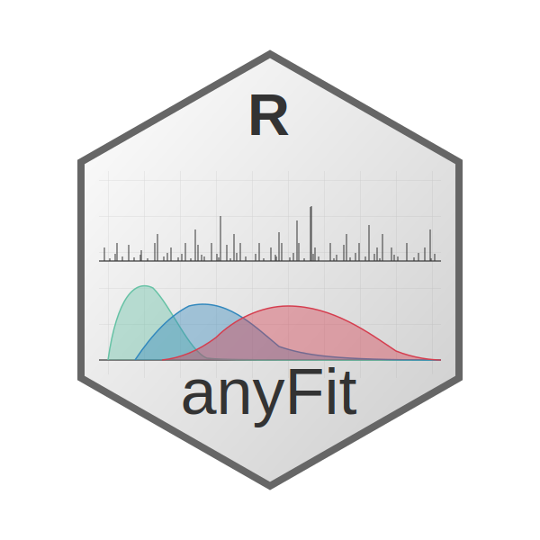

# anyFit 

Timeseries analysis of hydro-climatic variables is crucial for the study
of relevant physical processes as well as the design and forcing of a
plethora of physical and statistical models. However, physical processes
exhibit a wide range of distinct features that complicate their study.
For example:

- Seasonality
- Over-annual trends - long-term persistence
- Intermittency
- Highly skewed distributions
- Different forms of autocorrelation

Importantly, many of these physical characteristics act on different
scales, ranging from very fine (e.g. hourly) to very large (e.g. annual
or decadal). Additionally, advances in different technology sectors,
with a prominent position of the remote sensing industry, have made
publicly accessible, large databases of ground (e.g. NASA MODIS, KNMI)
and remote observations, hindcast and reanalysis models. All of the
above imply that tools developed for timeseries analysis, or more
commonly known exploratory data analysis (EDA) should:

- Be data agnostic
- Be able to handle multiple temporal scales
- Be easily extensible
- Be able to handle large sets of data from multiple stations/locations
  efficiently
- Be able to work with NetCDF files

AnyFit aims to address the above demands in a robust manner. It is based
on the eXtensible Time Series (xts) data format, which is a powerful
package that provides an extensible time series class, enabling uniform
handling of many R time series classes by extending zoo. For spatial
time series data, anyFit introduces the **sxts** (spatial xts) class —
an S3 extension of xts that stores spatial attributes (coordinates,
projection) alongside the time series data, enabling seamless spatial
operations without external raster intermediates. All visualization
functions are implemented in ggplot2. AnyFit is developed with
practitioners and researchers in mind, streamlining the EDA with the
stochastic modelling of hydroclimatic variables using the anySim package
and setting the foundations for a timeseries analysis and modeling
ecosystem. Notable examples of anyFit functionality include:

- Read directly from delimited files to xts format and from NetCDF to
  sxts format
- Identify gaps in data
- Produce summary statistics at various temporal scales (e.g. monthly,
  annual) with ease
- Perform distribution fitting at various temporal scales (e.g. monthly,
  annual) with ease
- Provides support for some “exotic” distributions, such as the Dagum
  and BurXII
- Extend summary statistics and distribution fitting functionality
  directly to spatial data and produce NetCDF files with results
- Streamline the visualisation of spatial statistics and raster maps
- Spatial masking of sxts objects by bounding box, shapefile, country,
  or continent
- Zonal statistics — aggregate sxts point data over polygon boundaries
  (shapefile, countries, or continents)

In detail the distributions supported by anyFit are the following:

- Exponential
- Rayleigh
- Gamma
- Normal
- Log-Normal
- Generalized Logistic
- 3-parameter Weibull
- Gumbel
- 3-parameter Gamma (PearsonIII)
- Generalized Extreme Value Distribution (GEV)
- Generalized Pareto Distribution (GPD)
- Generalized Gamma
- Generalized Gamma with location
- BurXII
- Dagum
- Exponentiated Weibull

## Installation

``` r

# install.packages("devtools")
devtools::install_github("Gapouliasis/anyFit")

# with the vignette
devtools::install_github("Gapouliasis/anyFit", build_vignettes = TRUE)
```

## Quick start

anyFit ships a real example dataset — E-OBS ensemble-mean daily rainfall
over Europe (0.25°, 2011–2022). The snippet below loads it clipped to
the UK, maps a statistic, and fits a distribution across the grid — in a
handful of lines.

``` r

library(anyFit)

f <- system.file("extdata", "rr_ens_mean_0.25deg_reg_2011-2022_v27.0e.nc",
                 package = "anyFit")

# Read the "rr" variable, clipped to the UK, as a spatial-xts (sxts) object
rain_uk <- nc2xts(f, varname = "rr",
                  country = "U.K. of Great Britain and Northern Ireland")

# Per-cell wet-day statistics, then map the mean and probability dry
stats <- basic_stats_nc(rain_uk, ignore_zeros = TRUE)
nc_ggplot(stats[[c("Mean", "Pdr")]], viridis.option = "mako")

# Fit candidate distributions by L-moments at every grid cell
fits <- fitlm_nc(rain_uk, ignore_zeros = TRUE, candidates = c("gamma", "burr"))
```

## Documentation

Full documentation, a function reference and worked articles are on the
[package website](https://gapouliasis.github.io/anyFit/). After
installing with the vignette you can also run
`browseVignettes("anyFit")`.
